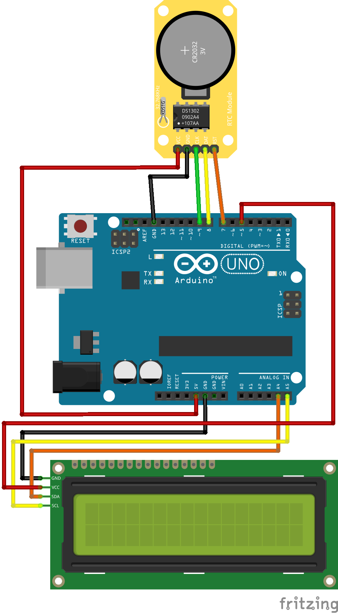

# 아두이노 UNO로 시계 만들어보기


## 목적

- 아두이노를 이용하여 현재시각을 알려주는 시계를 만들어보고 그것을 대구근대역사관 건물의 특징을 살린 케이스와 결합하는 것.


## 참여대상

- 초-중등 학생 35명 내외   

### ※ 주요 교육대상이 초등이기 때문에 최대한 상세하고 알기 쉽게!!


## 준비물

- 아두이노 UNO  - 1개
- LCD with I2C 모듈 - 1개
- RTC모듈(DS1302) - 1개
- 전원(9V) - 1개
- 9V 전용 배럴잭 어댑터 - 1개
- 케이블(암-수) - 15개


### 아두이노 UNO

아두이노는 작은 컴퓨터로, 모터나 센서 등 다양한 부품들을 연결하여 그에 맞는 프로그램을 업로드하면 이들을 작동시킬 수 있습니다. 이 외에도 상당히 많은 기능을 수행할 수 있습니다.     
아두이노의 종류는 매우 다양한데, 우리는 여러 아두이노 중에서도 가장 유명하고 보편적으로 사용하는 `아두이노 우노(Arduino UNO)`를 사용할 것입니다.   


### LCD with I2C

16x2  LCD에 I2C모듈이 결합된 모듈입니다. 우리는 이 LCD화면에 원하는 문구나 시간을 표시하게 됩니다. 


### RTC 모듈(DS1302)

시간에 대한 처리를 하는 시계 모듈입니다. 내부 전원이 존재하여 PC나 배터리의 연결을 끊더라도 계속 시간이 흘러갑니다.    


## 회로




# 코드 작성 가이드

1. 아두이노 IDE 설치 및 사용법 소개
2. 각 코드구간별로 소개
3. 시간 설정 방법 상세설명
4. (추가)LCD화면에 원하는 문구 띄우는법 소개


## 아두이노 통합개발환경(IDE) 설치하기

우선, 아두이노에 코드를 업로드 하기 위해서는 아두이노 통합개발환경(IDE)을 설치하여야 합니다. 다음 링크로 들어가서 본인의 PC 운영체제에 맞는 설치파일을 다운받고 설치를 진행합니다.


[통합개발환경(IDE) 설치파일 다운로드 링크](https://www.arduino.cc/en/software)


## 아두이노와 PC 연결하기

설치가 완료되었다면 아두이노를 PC에 연결합시다. 불이 깜빡거리죠? 이렇게 되면 정상적으로 연결된 겁니다. 

그 다음으로는 통합개발환경을 켜서 `툴` 탭에 들어가서 `보드` 부분과 `포트` 부분을 설정해줍니다. 우리는 아두이노 우노를 사용하니 Arduino UNO라고 적힌 보드를 선택하면 되겠죠? 그 다음엔 포트를 연결해주어야 하는데, `COM숫자(Arduino UNO)` 형식으로 나타날 겁니다. 이것을 선택해 주세요.    
여러분이 앞으로 아두이노를 연결할 때 줄곧 하나의 USB 포트에만 연결을 하면 상관없겠지만 다른 USB 포트에 연결하거나 하는 경우 포트설정을 다시 해주어야 해요. 아두이노를 연결하더라도 포트가 연결되어 있지 않으면 코드를 업로드할 수가 없습니다. 항상 주의해주세요!


### ※ 장치 연결 확인하기!   
→ 제어판-장치관리자 로 들어가서 포트 부분을 확인합니다.

## 라이브러리 설치하기

이제 아두이노를 연결하고 통합개발환경까지 설정해 주었다면 라이브러리를 설치해 주어야 합니다. 라이브러리는 우리가 사용할 모듈들(LCD, RTC 등)이 가진 기능들을 사용하려면 반드시 추가해 주어야 하는 것입니다. 

먼저, LCD with I2C에 관한 라이브러리를 설치해 주겠습니다. 

`툴` - `스케치` 로 들어가서 `라이브러리 매니저` 를 클릭합니다. 그리고 검색창에 `LiquidCrystal I2C` 라고 검색하여 `Frank de Brabander` 가 제작한 라이브러리의 버전을 선택하고 설치를 진행해줍니다. `INSTALLED` 라는 글씨가 뜨게 되면 설치가 완료된 것입니다.

그 다음으로는 RTC 모듈에 관한 라이브러리를 설치해 주어야 하는데, 이 라이브러리는 직접 압축파일을 다운받아 통합개발환경에 포함해 주어야 합니다. 다음 링크로 들어가서 압축파일을 다운받아 주세요. 

[msparks/arduino-ds1302](https://github.com/msparks/arduino-ds1302)


위 링크로 들어가서 초록색 버튼으로 된 `Code` 라는 글자를 클릭하고 `Download ZIP` 을 클릭하면 다운로드가 시작됩니다. 

이제, 다운이 완료된 압축파일을 풀지 않은 상태로 그대로 통합개발환경에 추가하도록 하겠습니다. `스케치` - `라이브러리 포함하기` - `.ZIP 라이브러리 추가...` 를 클릭한 뒤 우리가 방금 다운받은 압축 파일을 선택하여 열기를 누릅니다. 그러면 `라이브러리 포함하기` 에서 우리가 방금 추가한 압축파일이 포함된 것을 확인할 수 있습니다.

이제, 라이브러리까지 모두 준비가 되었습니다. 코드를 올려보도록 합시다!


## 코드 업로드하기   
다음 주어진 코드를 그대로 IDE에 입력합니다.


**시간설정을 할 때 주의할 점.**

주석처리된 부분(/* */로 감싸진 부분)의 주석을 해제하고 먼저 날짜와 시간을 업로드한 후, 다시 해제했던 구간을 주석처리하여 한번 더 업로드합니다.   
→ 전원을 분리했다가 다시 연결하여도 시간이 계속 그대로 흐르도록 하기 위함.


※ 만약, 날짜와 시간 말고 추가적으로 다른 메시지를 띄우고 싶다면 직접 설정할 수 있음!


## 코드   

    
```
#include <DS1302.h> //RTC모듈에 필요한 라이브러리
#include <LiquidCrystal_I2C.h> //LCD with I2C에 필요한 라이브러리

#define sclk 9 //RTC모듈의 SCLK 를 9번에 연결한다.
#define dat 8 //RTC모듈의 DAT 를 8번에 연결한다. 
#define rst 7 //RTC모듈의 RST 를 7번에 연결한다
#define power 5 //5번 핀을 5V 출력으로 사용할 것. 앞으로는 5 대신 power라고 사용할 것.

LiquidCrystal_I2C lcd(0x27, 16, 2); //LiquidCrystal_I2C 오브젝트 생성. 0x27은 주소
DS1302 rtc(rst, dat, sclk); //DS1302 오브젝트 생성


void setup() {
  digitalWrite(power, HIGH); //5번핀에 5V전압을 ON
  pinMode(power, OUTPUT); //핀을 출력모드로 설정한다. 
  
  lcd.init(); //LCD 초기화
  lcd.backlight(); //LCD 백라이트 켜기
  rtc.writeProtect(true); //쓰기금지모드 실행
  rtc.halt(false); //RTC timer 실행
  
/*
//날짜 및 시간 설정
  rtc.writeProtect(false); // rtc데이터를 수정하기 위해 쓰기금지모드를 해제
  rtc.halt(true); // 날짜와 시간을 수정하기 위해 RTC Timer을 정지시킴
  Time tm = rtc.time(); //RTC 내부 시간을 읽으면서 Time 오브젝트 생성
  tm.yr = 2020; //연도
  tm.mon = 10; //월
  tm.date = 19; //일
  tm.day = 2; //요일(1~7 -> 1:일, 2:월, 3: 화, 4: 수, 5: 목, 6: 금, 7:토)
  tm.hr = 14; //시간(24시 기준. 예)오후2시는 14로 표현)
  tm.min = 45; //분
  tm.sec = 0; //초
 
  rtc.time(tm); //수정한 값을 RTC에 기록
  rtc.halt(false); //Timer 다시 가동(정지 해제)
  rtc.writeProtect(true); //쓰기금지모드 실행
//여기까지 날짜 및 시간 설정부분
  */

}

void loop() {
 Time tm=rtc.time(); //rtc의 내부 시간을 읽으면서 Time 오브젝트 생성

 //날짜(연, 월, 일, 요일) 지정
 String str0 = " " + String(tm.yr) + "-" + String(tm.mon) + "-" + String(tm.date) + "(" + getWeek(tm.day) + ")";
 lcd.setCursor(0,0);
 lcd.print(str0); //LCD화면에 날짜 출력

 //시간(시, 분, 초) 지정
 lcd.setCursor(3,1);
 String str1;
 if(tm.min<10){ //분이나 초가 10 미만일 때도 두자리로 표현(00, 01 처럼)
  if(tm.sec<10){
    str1 = " " + String(tm.hr) + ":0" + String(tm.min) + ":0" + String(tm.sec);
  }
  else {
    str1 = " " + String(tm.hr) + ":0" + String(tm.min) + ":" + String(tm.sec);
  }
 }
 else{
  if(tm.sec<10){
    str1 = " " + String(tm.hr) + ":" + String(tm.min) + ":0" + String(tm.sec);
  }
  else{
    str1 = " " + String(tm.hr) + ":" + String(tm.min) + ":" + String(tm.sec);
  }
 }
 lcd.print(str1); //lcd화면에 시간 출력
 
 
 delay(1000); //1초에 한번씩 갱신하기 위해 딜레이 1초
 
 
}

//요일에 관한 문자열 생성
String getWeek(byte wk){
  switch(wk){
    case 1: return "Sun";
    case 2: return "Mon";
    case 3: return "Tue";
    case 4: return "Wed";
    case 5: return "Thu";
    case 6: return "Fri";
    case 7: return "Sat";
    default: return "Err";
  }
}
```


